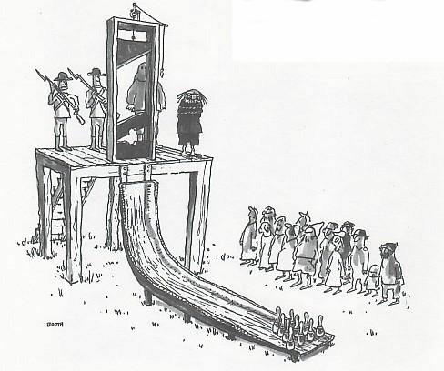

# The SE Research Reuse Manifesto 

<em>Tim Menzies  
Thomas Zimmermann  
Emerson Murphy-Hill   
Andrian Marcus</em>      

**If we take a more realistic view of software engineering research, and replace the _repeatability_ goal with one of partial _reuse_ of reserach artifacts, then we can open up and democratize the reserach process.**

________

_A belief is like a guillotine, just as heavy, just as light._ -- Frank Kafta

The traditional notion of the _research paper_ is 
 over-engineered,   too elaborate and  arcane, and too labor intensive to produce. 
 As a result:
 
+ Our industrial partners are locked out of research debates since they do not have time to write these ridiculously elaborate papers.
+ Researchers spent far too much time writing papers, when they should be creating new results.

We should send reserach papers to the guillotine. Chop them up, liberate their ideas, spread them around, thus granting
broader access to their various parts.  Vive la révolution.

Why?  We miust  demystify research results and make them available to a much broader audience. Normally, researchers write papers and present them at  conferences. But conferences should be more than about papers. Rather, they should be a place to visit to find “things” taht can be reused  for a wide range of tasks. 

The list of potentially reusable  “things” is  quite broad ranging and includes

+ Executables: e.g. standalone executable tools;
+ Non executables: 
       + e.g. a tutorial that explains complex research results to a generalist industrial audience;
       + e.g. the data associated with a challenge problem that represents the state of the art in some area.

Our idea:

+  Researchers should write their papers in on-line, frelly accessible "research repositories" (one per paper) where each repository contains the full text of their paper, as well as the scripts, tools, and other supporting materials that enable others to quickly use some or all of that work for other tasks.
+ We rush to add that it is something that many reserachers are doing already. E.g. many SE reserachers develop papers using on-line tools that integrate to, say, Github. Those reserachers are already dividing their _words_ into one repo per paper.
+ We only ask that they add to those repos the other artificats that make that paper do-able in the first place and (possible) partially reusable by others.
+ But we would further ask that the international research community changes its reveiew practices and allows for the seperate peer review of  any or all research artifacts within those repos.

## Some Theory

For years, software engineering research has lamented the lack of repeated results. Yet the art of software engineering continues to evolve. Today we can build bigger software systems, used by more people, that run on more computers, than ever before. Why? How?

Perhaps we have misunderstood _repeatable_, at least in the context of software.

+ In the hard science world, things hardly change. So when one scientist studies
a grain of grass, it is possible that previously reserachers might have seen the same kinds of grass. 
+ In the software world, things are softer and easier to change. So tomorrow's software applications are different
to that of today. Tomorrow, when we use software, we many be using different tools, touch different users, perform different tasks, run on different platforms. So when one software scientist studes a _database_, it may well be that that kind of _database_ has not been studied before.

Perhaps instead of _repeatbality_, we need to talk about partial _reusability_. That is, we want to read each other's code,
check out each other's systems, since it is possible that _some part_ of what they did is relevant to what we want to accomplish today. 

In this "reusability" mode, we take a hammer to prior products and cut them up into many pieces. These become menu items that we build new stuff by mixing and matching (or ignoring) some parts of old stuff.

To support that kind of _reuse_, we take a second look at _research artifact_. Such artifacts many be _smaller_ or _bigger_ than a single reserach paper: 

+ _Smaller:_ When an SE researcher delivers a paper, she is not reporting some complete diamond, perfect in every way, that is destroyed if any little part is removed. Rather, she is reporting on a complex combination of artifacts, any one of which might be useful in some other context.
+ _Bigger_: Papers are written using other artifacts scripts, data sets, tutorials downloaded from the Internet that helped the researcher understand some complex issue.

Also, some artifacts are not about the paepr per se but how to manage the tools associated with that paper. For example:

+ Configuration management tools that let others build the scripts (or even compile the paper and its figures and tables) and/or update those scripts.

For a full list of the kinds of artifacts we are considering see [our list of artifacts](ListOfArtifacts.md). 

## Implications for Publishing

Regardless of the nature of the artifact, we assert that reserachers should be rewarded for building these artifacts and maintaining them in freely available on-line locations. Specifically, in an ideal world _each of these artifacts should be seperately accessible and reviewable by the reserach community_.  It should be possible to submit for peer review:

+ Just the motivation statement that sparked the reseach.
+ Just the data assocaited with some challenge problem. 
+ Just the staistical tests used to analyze some experimental data.
+ Or any other of the artifacts listed in our [list of artifacts](ListOfArtifacts.md). 

Current practice is to review all of these only when they collected together in a research paper; i.e. only after teams of reserachers have wasted months on:
 
+ Problems that the rest of the community now think are pass&eacute; (e.g. the dreaded Seimans suite); 
+ Using data sets that are now out-of-date (e.g. the old NASA programs from the 1908s); 
+ Analyzed via statistical tests that are now considered uniformative (e.g. hypothesis testing without an effect size test).

Worse, for industrial practitioners, current practice means that they cannot join into the reserach discussion unless they spend far too much time writing complex papers that require multiple reserach artifacts:

+ To better integrate industry into research debates, we need to reduce the effort associated with the next paragraph in that debate (e.g. by allowing peer review on smaller sets of reserach artifacts).
+ Also, we need some way for industry to suggest promising directions for that research (e.g. by offering to community motivcational statemetns and data for challenge problems).

